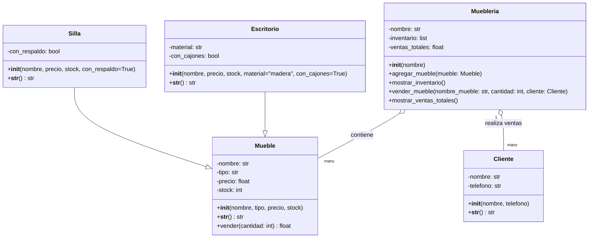
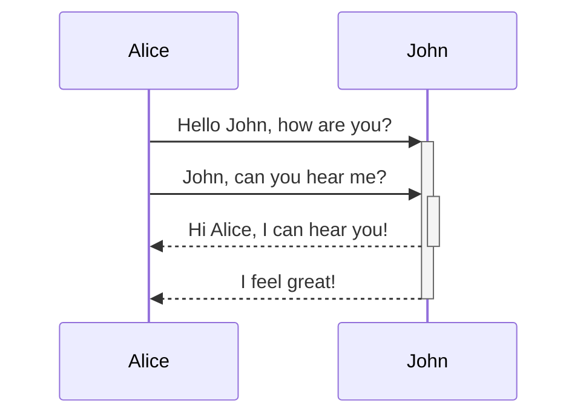
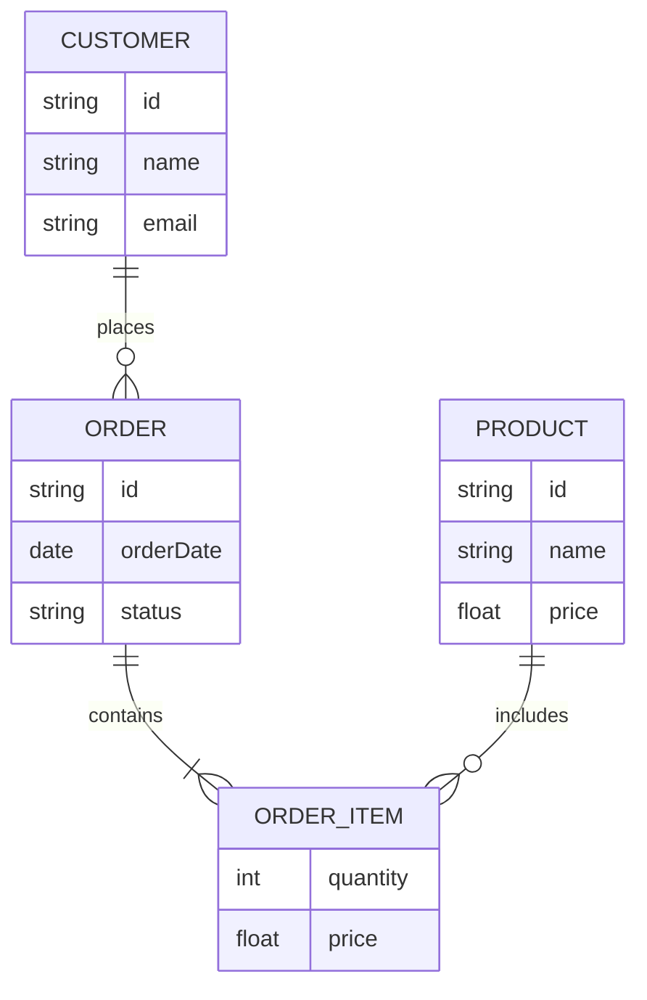

# Diagramas

En esta sección se presenta el diagrama de clases del sistema, elaborado con Mermaid.

El diagrama muestra la estructura de las clases principales, sus atributos, métodos y relaciones.
Se puede observar cómo Silla y Escritorio heredan de la clase base Mueble, lo que permite reutilizar código y mantener una jerarquía clara dentro del modelo de objetos.

Además, la clase Muebleria se relaciona con varias instancias de Mueble (asociación de tipo “uno a muchos”), y gestiona las interacciones con objetos de tipo Cliente.

Este diagrama es útil para comprender la arquitectura del sistema antes de revisar el código fuente, facilitando la documentación y comunicación técnica del proyecto.

## Diagrama de Clases

## Diagramas de Secuencia

## Diagrama Entidad - Relación

